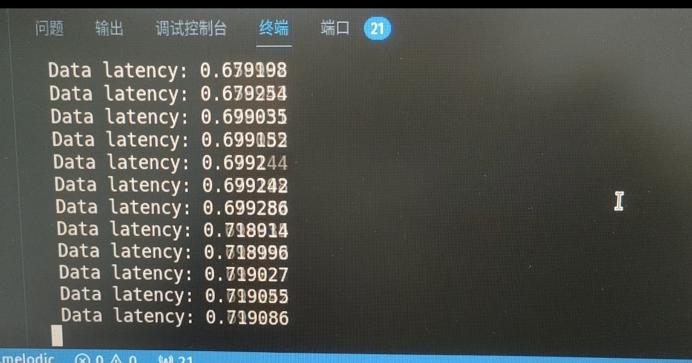
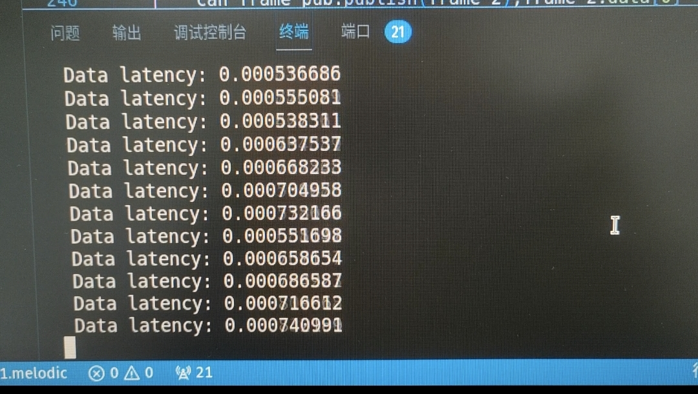
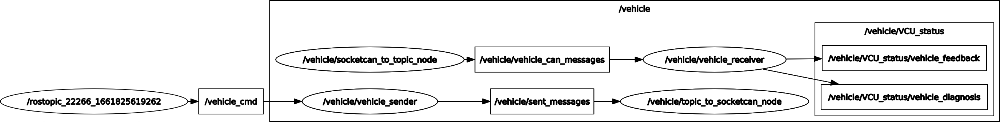

### 优化记录
---
#### 数据流分析

2.CAN消息传递
CMD -> can_frame -> mux_can_fountion->sent_messages->can_frame

### 解决方案：
修改解析方式，用互斥锁保证操作安全，延时从0.5～0.7缩小到0.0001～0.001

### TODO：
- 1.根据需要的命令重写解析的心跳机制，可以进一步优化解析时间
- 2.根据pub和sub频率以及callback执行时间，调整缓存区大小，提高实时性
- 3.优化互斥锁处理
- 4.不同帧的CAN信息通过循环中的不同函数处理。

可以使用虚拟can完成整个过程的调试

优化前：

优化后

### test cmd
 rostopic pub -r 10 /cmd_vel geometry_msgs/Twist "linear:
  x: 0.0
  y: 0.0
  z: 0.0
angular:
  x: 0.0
  y: 0.0
  z: 0.0" 

##  vehicle_can_socket
The 'vehicle_can_socket' Package used to encode and decode vehicle CAN protocol.So it contains two major node below
1.  'vehicle_sender': subscribe the control command from control node and encode command to ROS CAN messages format.Than send requires to 'topic_to_socketcan_node'.

2.  'vehicle_receiver': subscribe the vehicle feedback CAN messages from 'socketcan_to_topic_node' and parse feedback to human readable format.

##  socketcan_bridge
The 'socketcan_bridge' Package used to build a bridge between socketcan and ROS.That means you can use it convert real CAN frame format to ROS CAN messages format, vice versa.

##  Node graph
This graph may help you to understand how does these things work.

#	Dependencies
1.  Ubuntu18.04 OS(Recommend)
2.  ROS-melodic
3.  can-msgs

try this command below to install can-msgs enviorment.
>	sudo apt install ros-melodic-can-msgs

#	Usage
If you wana modify our protocol.Change path to 'vehicle_can_socket' Package
> roscd vehicle_can_socket

The directories you may interested.
1.	include: contains vehicle CAN protocols
2.	src: contains ROS message parse and CAN frame encode program

#	RUN && Test
Step 1 is not nessary if you already have a teemo chasis,this step used to test program on a computer without CAN card support.
So if you want to test offline,checkout to 'dev' branch.

##	1.Virtual CAN interface 
1.	Load the vcan kernel module: 
> sudo modprobe vcan
2.	Create the virtual CAN interface: 
> sudo ip link add dev vcan0 type vcan
3.	Bring the virtual CAN interface online: 
> sudo ip link set up vcan0

##  2.Launch Node
first make sure you are in right **path_to_your_ws**.
> cd path_to_your_ws

Than type this command to soure enviorment.
> source devel/setup.bash

And launch the 'socketcan_bridge'
> roslaunch socketcan_bridge socket.launch

After 'socketcan_bridge' successfully initialize can_device, open another terminal launch the 'vehicle_can_socket' in same way.
> source devel/setup.bash   \
> roslaunch vehicle_can_socket can_parse.launch

##  3.Test Require
To control the chasis,you can type this command below.
>rostopic pub -r 10 /vehicle_cmd geometry_msgs/TwistStamped '{
header: {seq: 0, stamp: 0, frame_id: },
twist: {
linear: {x: 0.3, y: 0.0, z: 0.0},
angular: {x: 0.1,y: 0.0,z: 0.0}
}
}'

##  4.Test Feedback
Open rqt and check the topic below

1.  "VCU_status/vehicle_diagnosis"
2.  "VCU_status/vehicle_status"
3.  "VCU_status/vehicle_feedback"
